# Documentazione

## Introduzione

La nostra base di dati ha l'obiettivo di gestire l'organizzazione degli esami universitari congiuntamente all'insegnamento associato ed ai vari corsi di laurea.  
Prevediamo 3 ruoli per l'utenza che utilizzerà il nostro database:

- La segreteria
- I docenti
- Gli studenti  

Ad ogni ruolo sono associate diverse funzionalità ed accesso ad informazioni diverse  

---

## Progettazione schema concettuale ER

**Schema ER completo (non ristrutturato):**
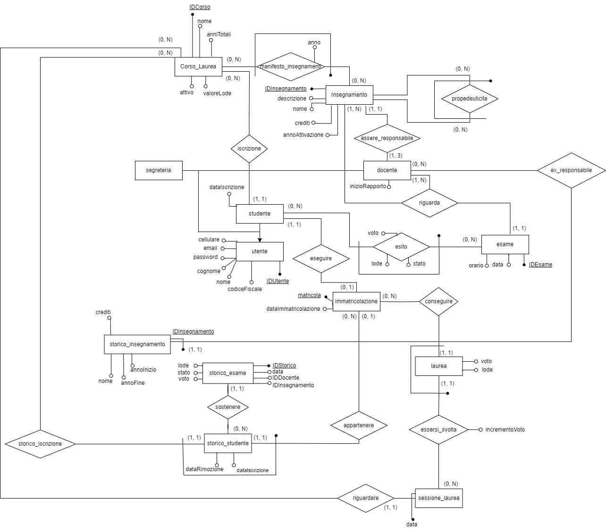  
  
- _Utenti_  
  Le informazioni di accesso per gli utenti della nostra base di dati vengono salvate nell'entità (generalizzazione) _Utente_

  In essa inoltre conserviamo le informazioni comuni a tutti gli utenti: nome, cognome e cellulare

- _Docente e Segreteria_  
L'entità _segreteria_ non gode di attributi che la contraddistinguono mentre per il _docente_ prevediamo due attributi per conservare l'inizio e la fine del rapporto di collaborazione con l'università

- Studente e Matricola  
L'entità _studente_, che rappresenta gli studenti iscritti attualmente nell'università in un _corso di laurea_, è in relazione con l'entità _Matricola_ che contiene la matricola, con cui identifichiamo lo studente, ed il suo codice fiscale.  
Prevediamo infatti di voler ricavare attraverso il codice fiscale, che consideriamo unico, la matricola di un ex-studente in modo tale che, nonostante non sia piu presente nell'entità _studente_, gli venga comunque riassegnata la sua precedente matricola cosicchè non si creino nuove matricole, nel caso di una nuova iscrizione ad un nuovo corso di laurea.  

Ipotizziamo che i dati presenti in _matricola_, _docente_ e _utente_ **NON** vengano mai cancellati

- Corso_Laurea  
I corsi di laurea sono identificati nell'entità '_corso_laurea_' da un identificativo incrementale, mentre sono caratterizzati dal nome, dagli anni totali del corso (3 per la triennale, 2 per la magistrale), dal valore della lode (per es la lode nella media puo essere considerata come un 30 o come un 32) e dal campo che identifica se il corso di laurea sia attivo o meno.  
Per semplicità ipotizziamo che i corsi di laurea **NON** vengano mai cancellati  

- Insegnamento e propedeuticità  
Gli insegnamenti sono contenuti nell'entità _insegnamento_ la cui chiave primaria è un id incrementale mentre i suoi attributi sono il nome, il numero di crediti, il docente responsabile, una descrizione eventualmente nulla e l'anno in cui è stato attivato tale insegnamento.  
Il docente responsabile è inizialmente NULL, in quanto richiediamo che ogni docente sia responsabile di **ALMENO** un insegnamento fino ad un **MASSIMO** di 3.  
Prevediamo inoltre la relazione ricorsiva di _propedeuticita_ che permette di specificare per un insegnamento, gli insegnamenti propedeutici necessari per il conseguimento del suddetto insegnamento.  
Ipotizziamo che una volta inseriti, **NON** vengano eliminati gli insegnamenti

- Manifesto insegnamenti  
Inizialmente ad un corso di laurea non è associato alcun insegnamento.  
La relazione tra i corsi di laurea e gli insegnamenti è denotata dal _manifesto_insegnamenti_ che ci permette di sapere gli insegnamenti previsti in un corso di laurea con associato l'anno in cui è previsto che si svolgano (1, 2, 3 per i corsi triennali; 1, 2 per quelli magistrali)  
Ipotizziamo, che una volta inseriti, **NON** vengano modificati/eliminati i record del manifesto

- Esame e esito  
L'entità _esame_ contiene le informazioni di una sessione di esame, in particolare è identificato da un id numerico incrementale e contiene l'orario e la data in cui si svolge, l'insegnamento e il docente che terrà tale esame. Quest'ultimo **deve** essere lo stesso docente responsabile del corso MA prevediamo che il docente responsabile possa cambiare, quindi salviamo tale informazione come attributo dell'esame.  
Data una sessione di esame, registriamo nell'entità _esito_ sia l'iscrizione di uno studente ad una sessione d'esame che l'esito effettivo dell'esame. Per far ciò utilizziamo il campo "stato" che distinguerà il record come iscrizione all'esame o come esito effettivo.

- Storico degli insegnamenti  
Come già esplicato, prevediamo la possibilità di poter cambiare il docente responsabile di un insegnamento, ma allo stesso tempo prevediamo uno _storico_insegnamento_ in cui conserviamo i vari docenti che sono stati responsabili degli insegnamenti.  
_Nota : la chiave primaria dello storico poteva essere anche la chiave esterna dell'entità_Insegnamento_dato che non prevediamo la cancellazione di record. Tuttavia questa soluzione con un IDInsegnamento che non referenzia l'entità_insegnamento_è utile nel caso in cui si preveda la cancellazione degli insegnamenti._

- Laurea e sessione di laurea  
Quando uno studente ha conseguito tutti gli insegnamenti del suo corso di laurea, gli sarà concesso di iscriversi ad una sessione di laurea, presente in _sessione_laurea_. Le sessioni in cui ci si può laureare sono identificate dal corso di laurea e dalla data.  
Per semplicità non consideriamo orari, aule o sedi in cui si svolgeranno tale evento.  
L'iscrizione ad una sessione di laurea avviene analogamente a quanto accade con _esame-esito_. L'entità _laurea_ infatti conterrà sia gli studenti iscritti ad una sessione di laurea che gli studenti laureati di cui, a differenza di quelli iscritti, hanno gli attributi voto, lode e incremento diversi da NULL.  
_Nota : la chiave esterna che compone la chiave primaria della laurea proviene dall'entità **matricola** e **NON** da studente, in quanto a seguito della laurea, viene prevista la cancellazione del record dello studente nell'entità studente_

- Storico degli studenti e storico degli esami  
Una volta che uno studente consegue la laurea o decide di eseguire una rinuncia agli studi, prevediamo la cancellazione dei suoi dati in _studente_ e in _esito_
e congiutamente il trasferimento di tali informazioni in due apposite entità: _storico_studente_ e _storico_esame_.  
Lo _storico_studente_ è in relazione con _matricola_ in quanto non prevediamo la cancellazione della matricola associata allo studente. In questo modo non risulta piu iscritto al corso di laurea MA le sue informazioni restano nel sistema. Anche in questa entità infatti l'identificativo sarà composto dalla matricola e dall'identificativo del corso di laurea.  
Per semplicità ipotizziamo che uno studente non esegua la rinuncia agli studi per due volte per lo stesso corso di laurea o che non si iscriva al corso di laurea per cui ha già ottenuto la laurea.  
Lo _storico_esame_ invece contiene le informazioni dell'esito dell'esame: il voto, lo stato e la lode.
Come chiavi esterne utilizziamo la matricola e il corso di laurea referenziandole allo storico studente. In aggiunta prevediamo anche l'identificativo dell'insegnamento e del docente responsabile del tempo in quanto NON possiamo utilizzare quelli dello storico_insegnamenti. Al momento dell'eliminazione dello studente i dati dell'insegnamento potrebbero non essere cambiati e quindi non presenti nello storico_insegnamenti  
La soluzione a tale problema richiederebbe di "mischiare" insegnamenti effettivamente conclusi con quelli ancora inclusi nello storico_insegnamenti  
_Nota : per evitare di avere come chiave primaria una chiave composta da matricola, IDCorso, IDInsegnamento e IDDocente, utilizzo IDStorico, un intero incrementale._

---
**Schema ER completo (ristrutturato)**
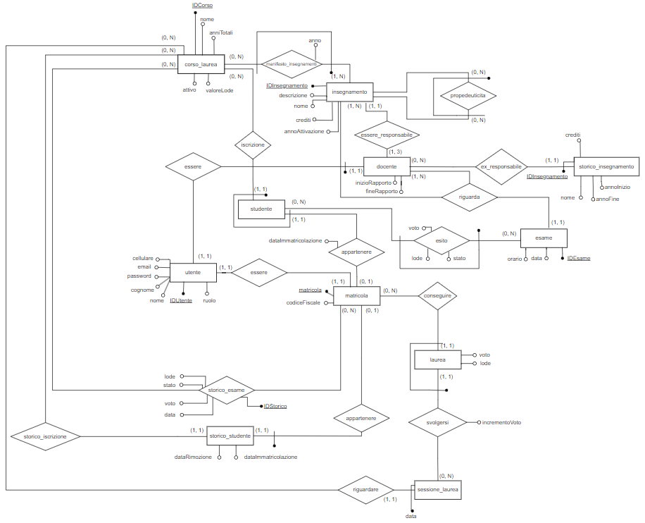  
Ristrutturando l'ER, lascio nell'entità _utente_ gli attributi comuni della generalizzazione. Elimino l'entità _segreteria_, in quanto non aveva piu alcun attributo, mentre l'entità _docente_ rimane e conserva i suoi due campi specifici utilizzando come chiave primaria la chiave esterna di utente, _IDUtente_ rinominandola IDDocente.

L'entità _studente_ invece, non sarà piu direttamente relazionata con utente, ma passerà per _matricola_ utilizzando la chiave primaria, matricola, per comporre la propria primaria congiuntamente ad IDCorso.  
_matricola_ associerà ad ogni matricola l'identificativo dell'utente, che sarà unico nella tabella come il codice fiscale. Facendo ciò le informazioni contenute in utente sono indipendenti dal corso che segue lo studente in modo tale, che qualora venisse eliminato da _studente_, possa comunque accedere al db grazie alle credenziali conservate e associate ancora con la propria matricola.  

_Nota_ : l'entità esito è associata con l'entità matricola in modo tale che abbia la chiave primaria composta da 2 attributi invece che da 3 (nel caso in cui fosse referenziata con la chiave primaria di studente)

---

## Progettazione logica

| Nome Tabella           | Attributi             | Tipo         | Chiave  | Vincoli         | Default      |
| ---------------------- | --------------------- | ------------ | ------- | --------------- | ------------ |
| utente                 | IDUtente              | SERIAL       | PK      |                 |              |
|                        | ruolo                 | ruolo        |         | NOTNULL         |              |
|                        | nome                  | varchar(50)  |         | NOTNULL         |              |
|                        | cognome               | varchar(50)  |         | NOTNULL         |              |
|                        | email                 | varchar(100) |         | NOTNULL, UNIQUE |              |
|                        | password              | varchar(32)  |         | NOTNULL         |              |
|                        | cellulare             | varchar(20)  |         | NOTNULL         |              |
|                        |                       |              |         |                 |              |
| docente                | IDDocente             | integer      | PK, FK  |                 |              |
|                        | inizioRapporto        | date         |         | NOTNULL         |              |
|                        | fineRapporto          | date         |         |                 | NULL         |
|                        |                       |              |         |                 |              |
| studente               | IDCorso               | varchar(20)  | PPK, FK |                 |              |
|                        | matricola             | char(6)      | PPK, FK | UNIQUE          |              |
|                        | dataImmatricolazione  | date         |         | NOTNULL         | CURRENT_DATE |
|                        |                       |              |         |                 |              |
| matricola              | matricola             | varchar(6)   | PK      |                 |              |
|                        | codiceFiscale         | varchar(16)  |         | NOTNULL, UNIQUE |              |
|                        | IDUtente              | integer      | FK      | NOTNULL, UNIQUE |              |
|                        |                       |              |         |                 |              |
| corso_laurea           | IDCorso               | varchar(20)  | PK      |                 |              |
|                        | nome                  | varchar(100) |         | NOTNULL         |              |
|                        | anniTotali            | tipoLaurea   |         | NOTNULL         |              |
|                        | valoreLode            | integer      |         | NOTNULL         |              |
|                        | attivo                | boolean      |         | NOTNULL         | True         |
|                        |                       |              |         |                 |              |
| insegnamento           | IDInsegnamento        | SERIAL       | PK      |                 |              |
|                        | IDDocente             | integer      | FK      |                 | NULL         |
|                        | nome                  | varchar(200) |         | NOTNULL         |              |
|                        | descrizione           | text         |         |                 |              |
|                        | crediti               | integer      |         | NOTNULL         |              |
|                        | annoAttivazione       | integer      |         | NOTNULL         |              |
|                        |                       |              |         |                 |              |
| manifesto_insegnamenti | IDInsegnamento        | integer      | PPK, FK |                 |              |
|                        | IDCorso               | varchar(20)  | PPK, FK |                 |              |
|                        | anno                  | annoCorso    |         | NOTNULL         |              |
|                        |                       |              |         |                 |              |
| propedeuticita         | insegnamento          | integer      | PPK, FK |                 |              |
|                        | insegnamentoRichiesto | integer      | PPK, FK |                 |              |
|                        |                       |              |         |                 |              |
| esame                  | IDEsame               | SERIAL       | PK      |                 |              |
|                        | IDDocente             | integer      | FK      | NOTNULL         |              |
|                        | IDInsegnamento        | integer      | FK      | NOTNULL         |              |
|                        | data                  | date         |         | NOTNULL         |              |
|                        | orario                | time         |         | NOTNULL         | 12:00        |
|                        |                       |              |         |                 |              |
| esito                  | matricola             | char(6)      | PPK, FK |                 |              |
|                        | IDEsame               | integer      | PPK, FK |                 |              |
|                        | voto                  | voto         |         |                 | NULL         |
|                        | stato                 | statoEsito   |         |                 | In attesa    |
|                        | lode                  | boolean      |         |                 | NULL         |
|                        |                       |              |         |                 |              |
| storico_insegnamento   | IDDocente             | integer      | PPK, FK |                 |              |
|                        | IDInsegnamento        | integer      | PPK     |                 |              |
|                        | nome                  | varchar(200) |         | NOTNULL         |              |
|                        | crediti               | integer      |         | NOTNULL         |              |
|                        | annoInizio            | integer      |         | NOTNULL         |              |
|                        | annoFine              | integer      |         | NOTNULL         |              |
|                        |                       |              |         |                 |              |
| storico_studente       | matricola             | char(6)      | PPK, FK |                 |              |
|                        | IDCorso               | varchar(20)  | PPK, FK |                 |              |
|                        | dataImmatricolazione  | date         |         | NOTNULL         |              |
|                        | dataRimozione         | date         |         | NOTNULL         | CURRENT_DATE |
|                        |                       |              |         |                 |              |
| storico_esame          | IDStorico             | SERIAL       | PK      |                 |              |
|                        | matricola             | char(6)      | FK      | NOTNULL         |              |
|                        | IDCorso               | varchar(20)  | FK      | NOTNULL         |              |
|                        | IDInsegnamento        | integer      |         | NOTNULL         |              |
|                        | IDDocente             | integer      |         | NOTNULL         |              |
|                        | voto                  | voto         |         |                 |              |
|                        | stato                 | statoEsito   |         | NOTNULL         |              |
|                        | lode                  | boolean      |         |                 |              |
|                        | data                  | date         |         | NOTNULL         |              |
|                        |                       |              |         |                 |              |
| laurea                 | matricola             | char(6)      | PPK, FK |                 |              |
|                        | data                  | date         | PPK, FK |                 |              |
|                        | IDCorso               | varchar(20)  | PPK, FK |                 |              |
|                        | voto                  | votoLaurea   |         |                 | NULL         |
|                        | incrementoVoto        | integer      |         |                 | NULL         |
|                        | lode                  | boolean      |         |                 | NULL         |
|                        |                       |              |         |                 |              |
| sessione_laurea        | data                  | date         | PPK     |                 |              |
|                        | IDCorso               | varchar(20)  | PPK, FK |                 |              |
---

## Realizzazione database: uni

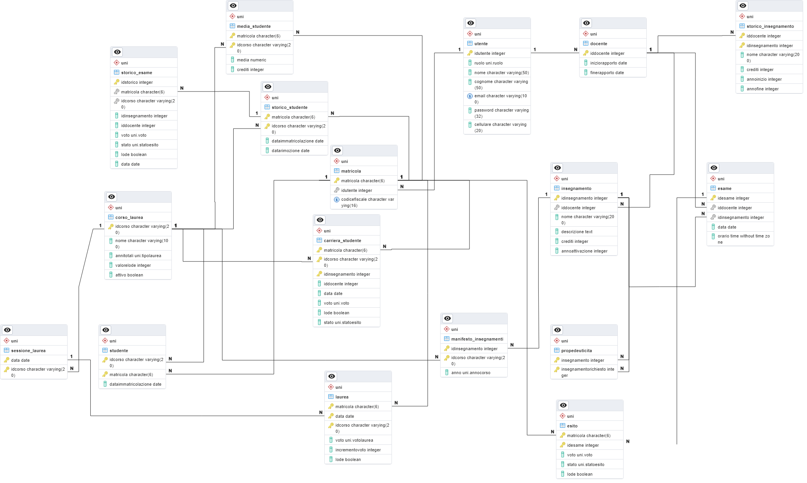  
Dal punto di vista implementativo della base di dati, ho scelto di inserire due viste materializzate per motivi di ottimizzazione aggiornandole attraverso trigger.  
In particolare:

- **uni.media_studente**: conserviamo in essa, per ogni studente che frequenta/ha frequentato un certo corso di laurea, la sua media pesata con i relativi crediti.  
- **uni.carriera_studente**: contiene, per ogni studente che frequenta/ha frequentato un corso di laurea gli esami superati e con esito accettato.

Oltre a ciò prevedo delle viste per restituire in modo completo informazioni presenti in diverse tabelle.
In particolare:

- **uni.studente_bio**: restituisce le informazioni dello studente iscritto: la sua matricola, il nome, il cognome, la email, il cellulare, il corso a cui è iscritto e la data di immatricolazione.  
- **uni.carriera_studente_view**: restituisce le informazioni contenute nella vista materializzata _uni.carriera_studente_.  
- **uni.carriera_completa_studente**: restituisce per ogni matricola iscritta ad un corso di laurea tutti gli esami a cui è stato iscritto.

### Elenco domini DB

| Nome Dominio | Valori                                                                           | Condizione               |
| ------------ | -------------------------------------------------------------------------------- | ------------------------ |
| ruolo        | {"Segreteria", "Docente", "Studente"}                                            | Elenco                   |
| tipoLaurea   | {3, 2}                                                                           | Elenco                   |
| annoCorso    | {1, 2, 3}                                                                        | Elenco                   |
| voto         | [0, 1, .., 30]                                                                   | value>=0 AND value<=30   |
| statoEsito   | {"Ritirato", "Rifiutato", "In attesa", "In attesa di accettazione",  "Bocciato"} | Elenco                   |
| votoLaurea   | [60, …, 110]                                                                     | value>=60 AND value<=110 |

---

## Funzionalità realizzate

L'elenco delle funzioni, procedure e trigger creati è presente per intero sia nel dump del database uni_empty_dump.sql (<https://github.com/michelebolis/UniversityExamSystem/tree/main/uni_empty_dump.sql>) che nelle documentazioni specifiche (  
    - doc_function: <https://github.com/michelebolis/UniversityExamSystem/tree/main/documentazione/doc_function.md>
    -  doc_trigger: <https://github.com/michelebolis/UniversityExamSystem/tree/main/documentazione/doc_trigger.md>  
)  

Qui di seguito vengono evidenziate le parti piu rilevanti per il funzionamento corretto del database.  
In generale ho cercato di realizzare un sufficiente insieme di procedure/funzioni in modo tale da riuscire, lato backend dell'applicativo, ad interrogare ed interagire con il database senza essere a conoscenza dello schema delle tabelle.  

Per garantire ciò prevedo vari funzioni di _get_ e _get_all_ per la maggior parte delle tabelle, congiuntamente anche a procedure _insert_ per popolarle. Tuttavia, per mantenere la consistenza e correttezza della base di dati, ho previsto, durante la creazione delle tabelle, varie clausole check (per es prevedendo che i campi di tipo varchar non siano vuoti) oltre all'utilizzo di domini specifici (per es il dominio _uni.ruolo_ e _uni.voto_).  

Per esempio, per la registrazione di un esame, grazie all'apposita procedura _uni.registrazione_esito_esame_ non vi è la necessità di specificare se lo studente è stato bocciato o meno, ma lo stato dell'esito verrà ricavato dal voto. Un ragionamento analogo è stato utilizzato per l'inserimento degli utenti con apposite procedure insert che non richiedono il ruolo ma che, in base alla procedura, inserisce automaticamente il ruolo in _utente_ insieme alle altre informazioni grazie a una procedura generale _insert_utente_.

Infine, prevedendo il caso che l'utilizzatore della base di dati non utilizzi le procedure predisposte, ho aggiunto, per i casi piu problematici, appositi trigger:

- **update_media**: trigger per garantire la consistenza della vista materializzata _media_studente_ quando viene accettato un nuovo esito.  
- **check_insertesito**: trigger per controllare la correttezza dell'iscrizione ad un esame di uno studente
- **check_updateesito**: trigger per garantire la correttezza dei dati in _esito_ dato il valore del campo _stato_ e lo _stato_ precedente all'update  
- **num_responsabile**: trigger che garantisce che ogni insegnante abbia almeno 1 insegnamento di cui è responsabile e al massimo 3
- **move_to_storico_studente**/**move_to_storico**: il secondo trigger elimina lo studente da _studente_ in modo che si attivi il primo trigger che sposta i dati di studente prima che sia eliminato in _storico_studente_
- **hash**: permette di rendere indipendete l'applicazione della funzione di hash dalla procedura di inserimento utente che potrebbe non essere invocata.

---

## Applicativo Web: introduzione

Per far interagire gli utenti con la base di dati, ho realizzato un applicativo Web in modo da semplificarne l'utilizzo. A seguito del login effettuato, verranno caricate diverse schermate in base al ruolo identificato.  
Tecnologie utilizzate:  

- Lato frontend ho utilizzato le classi di Bootstrap per il menu e gli elementi sottostanti ad esso congiuntamente ad un foglio di stile per aggiungere dei colori.
- Lato backend ho utilizzato php creando funzioni con la stessa segnatura e nome di quelle create nel database, in modo tale da avere una certa coerenza. In generale le eventuali eccezioni che possono essere sollevate vengono gestite dall'utilizzatore della funzione a cui viene restituito o il risultato (nelle _get_) o eventualmente l'ultimo errore di postgres (nelle _insert_ e nelle _update_).

Organizzazione dei file: le pagine effettive che verranno visualizzate sono presenti nel root della directory mentre i componenti che verranno inclusi grazie php in modo dinamico sono presenti nella cartella _template_.  
Le varie funzioni di php si trovano nella cartella _lib_ e in generale sono categorizzate in _insert_, _get_, _update_ e _delete_. Al di fuori di questa divisione, troviamo altre funzioni come quelle di connessione (_connection.php_) e di configurazione della connessione (_config.php_) che verranno incluse dalle altre in modo da connettersi al database.  

  
La struttura dei file _template_nome.php_ è indicativamente sempre la stessa: definisco una funzione di print del form con argomento l'eventuale errore che verrà stampato come primo elemento del form.
Questa funzione viene chiamata, e quindi viene stampato il form, se le variabili in POST non sono settate, e quindi non ho ancora premuto sul bottone che fa il submit alla stessa pagina.  
Se invece tali variabili sono settate, richiamo la funzione php che a sua volta chiama la funzione/procedura pgsql utilizzando le variabili in POST. Dalla funzione pgsql è possibile che vengano restituiti degli errori, in tal caso richiamo la funzione di _printform_ passandogli l'errore ricevuto e inserendo negli input del form i valori nelle variabili di POST che hanno causato l'errore.  
Nel caso in cui non ci siano errori, non viene visualizzato il form ma un messaggio che segnala il corretto esito dell'operazione.

---

## Applicativo Web: realizzazione  

- ### Login  

All'avvio sarà necessario effettuare con la propria email e password. Se le credenziali non risultano nel database, viene visualizzato in messaggio di errore.
Nel caso invece l'accesso sia eseguito correttamente, vengono settate due variabili di sessione per conservare l'id dell'utente e il suo ruolo, in base al quale verranno caricate le successive interfacce. Per ciascun utente vengono visualizzate nella pagina iniziata le informazioni biografiche contenute in _utente_.  
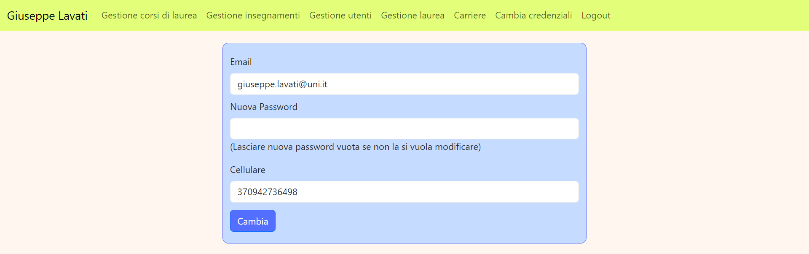
Si potrà eventualmente cambiare le credenziali di accesso dall'apposita opzione nel menu.  
E' anche possibile effettuare in qualsiasi momento effettuare il logout, che toglierà le variabili di sessione, viasualizzando nuovamente la schermata di login.  
Nota: le credenziali degli utenti predisposti nel file di esempio sono presenti in _credenziali.md_.

Analizziamo le possibilità offerte per ciascun utente:

- ### Segreteria

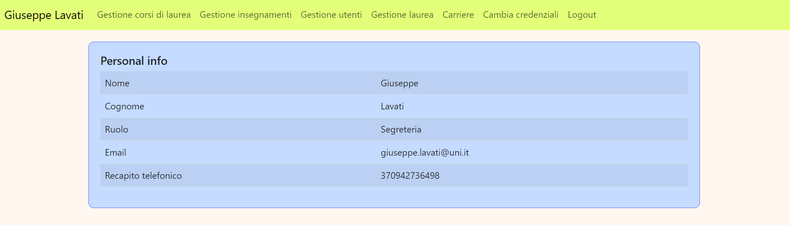
Attraverso il menu della segreteria sarà concesso di:  

1. La gestione dei corsi di laurea  
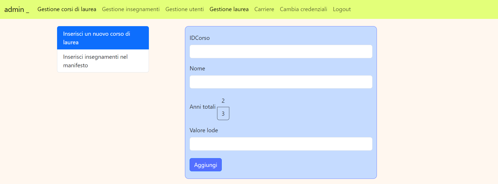
L'utente della segreteria può inserire nuovi corsi di laurea ed aggiungere nel manifesto degli insegnamenti di un corso di laurea un insegnamento.
Per far ciò sarà però necessario che siano presenti degli insegnamenti.

2. La gestione degli insegnamenti
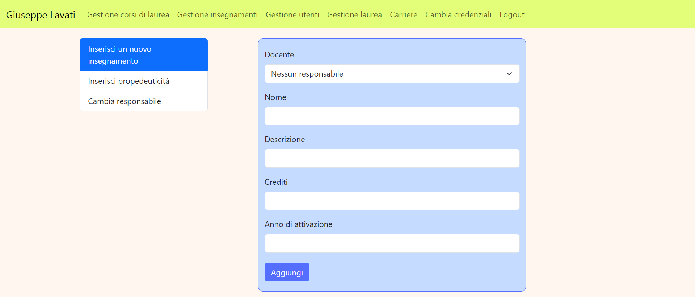
Come nel punto precedente, la segreteria potrà aggiungere nuovi insegnamenti, specificando eventualmente il docente responsabile.  
E' possibile poi inserire la propedeuticità di un insegnamento rispetto ad un altro e cambiare il docente responsabile di un insegnamento.

3. La gestione degli utenti

Gli utenti della segreteria sono gli unici ad avere la capacità di inserire nuovi utenti nella base di dati, in particolare altri utenti della segreteria, un nuovo studente o un nuovo docente. E' quindi prima necessario il ruolo dell'utente che si sta per aggiungere. Verranno poi caricate caricate le informazioni da inserire in base al ruolo selezionato.  
Chiaramente inizialmente sarà necessario avere un utente della segreteria nella base di dati per permettere di aggiungerne altre dall'applicativo: ho previsto quindi, nel dump del database vuoto, un utente segreteria _admin_.
Nota: nell'inserimento di un nuovo studente viene visualizzato un errore se il corso di laurea a cui si sta iscrivendo non ha ancora insegnamenti nel manifesto degli studi.  
Oltre ad inserire nuovi utenti, possono anche eseguire la rinuncia agli studi degli studenti, selezionandoli da un apposita select.

4. La gestione delle lauree  

Le sessioni di laurea non sono associate ad alcun docente, quindi sono gestite dalla segreteria che aggiunge nuove sessione di laurea per un corso di laurea in una data. Successivamente procederà a registrarne l'esito per gli iscritti.

5. La visualizzazione delle carriere  
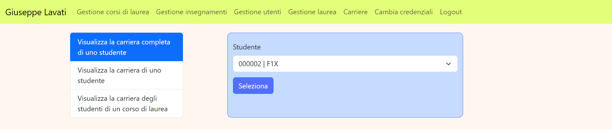
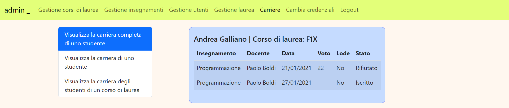
La segreteria è infine in grado di visualizzare le carriere di ogni studente, in particolare quella completa conterrà anche gli esami non superati/rifiutati/senza valutazione mentre l'altra conterrà solo gli esami con esito positivo accettato.
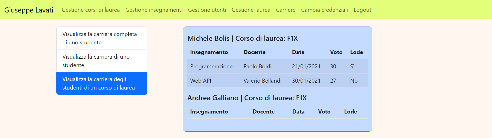
E' inoltre possibile visualizzare la carriera (non completa) di tutti gli studenti di un corso di laurea.

- ### Docente  

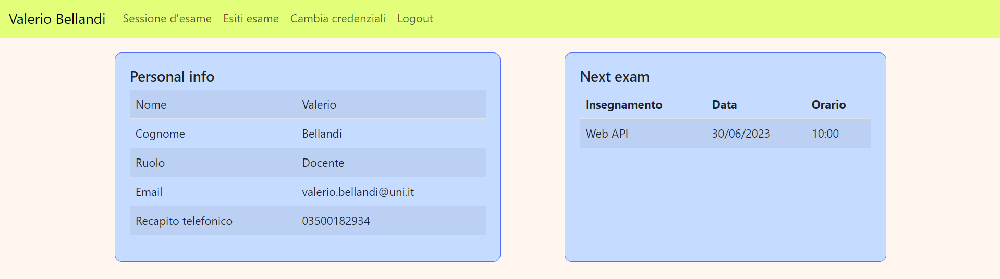
Oltre alle informazioni di base, vengono visualizzati i prossimi esami in programma per il docente.
Attraverso il menu del docente sarà concesso di:  

1. Gestione degli esami
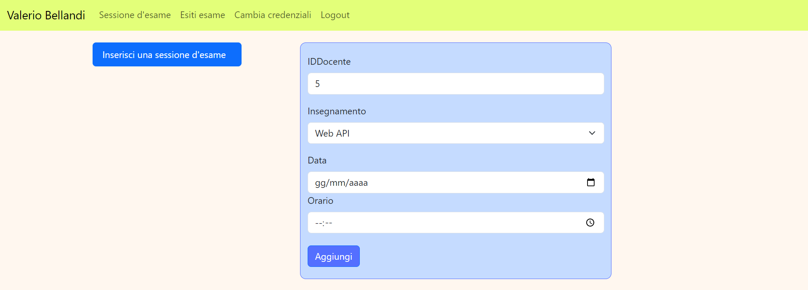
Il docente responsabile del corso deve inserire le sessioni di laurea per gli insegnamenti di cui è responsabile in modo tale che gli studenti si possano iscrivere.
2. Gestione degli esiti

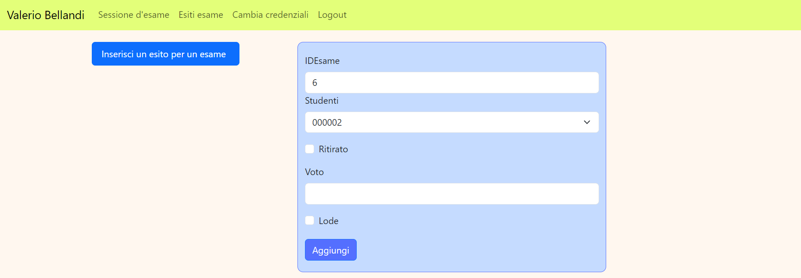
Il docente dovrà poi, in una data successiva a quella della sessione di esame, registrare gli esiti degli studenti iscritti, selezionandoli dall'apposita select.  
Oltre all'inserimento del voto, sarà possibile registrare il ritiri dello studente dall'esame con l'apposita spunta (eventuali altri valori inseriti negli altri text verranno ignorati).

- ### Studente

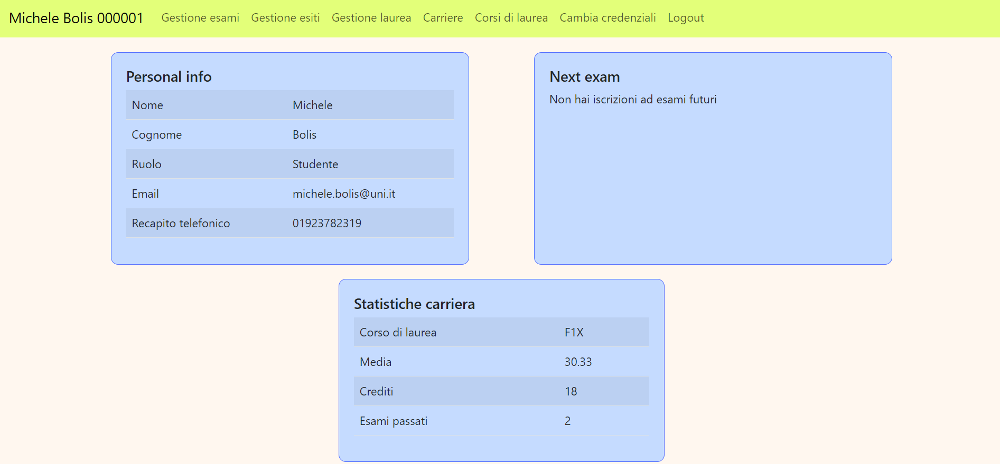  
Oltre alle informazioni di base, vengono visualizzati i prossimi esami in programma a cui si è iscritto lo steudente. Vengono inoltre mostrate le statistiche dello studente per il corso di laurea a cui è iscritto: media, numero di crediti ottenuti ed esami passati.  

- ### Caso particolare: ex-studente

---
