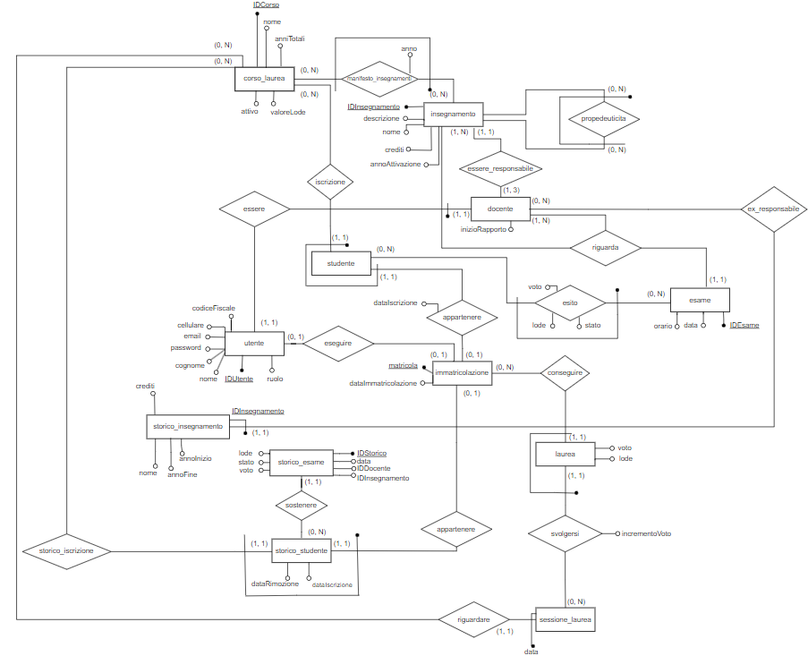

# Documentazione 
## Introduzione
La nostra base di dati ha l'obiettivo di gestire l'organizzazione degli esami universitari congiuntamente all'insegnamento associato ed ai vari corsi di laurea.  
Prevediamo 3 ruoli per l'utenza che utilizzerà il nostro database:
 - La segreteria
 - I docenti
 - Gli studenti  

Ogni ruolo ha associate relative funzionalità ed accesso ad informazioni diverse.  
___
## Progettazione schema concettuale ER
**Schema ER completo (non ristrutturato):**
  
  
- _Utenti_  
  Le informazioni di accesso per gli utenti della nostra base di dati vengono salvate nell'entità (generalizzazione) _Utente_

  In essa inoltre conserviamo le informazioni comuni a tutti gli utenti: Nome, Cognome e cellulare

- _Docente e Segreteria_  
L'entità _Segreteria_ non gode di attributi che la contraddistinguono mentre per il _Docente_ prevediamo due attributi per conservare l'inizio e la fine del rapporto di collaborazione con l'università

- Studente e Matricola  
L'entità _Studente_, che rappresenta gli studenti iscritti attualmente nell'università in un _Corso di laurea_, è in relazione con l'entità _Matricola_ che contiene la matricola, con cui identifichiamo lo studente, e il suo codice fiscale.  
Prevediamo infatti di voler ricavare attraverso il codice fiscale che consideriamo unico, la matricola di uno ex-studente in modo tale che nonostante non sia piu presente nell'entità _Studente_, gli venga comunque riassegnata la sua precedente matricola cossichè non si creano nuove matricole nel caso di una nuova iscrizione ad un nuovo corso di laurea.  

Ipotizziamo che i dati presenti in _Matricola_, _Docente_ e _Utente_ **NON** vengano mai cancellati

- Corso_Laurea  
I corsi di laurea sono identificati nell'entità '_Corso_laurea_' da un identificativo incrementale mentre sono caratterizzati dal nome, dagli anni totali del corso (3 per la triennale, 2 per la magistrale), il valore della lode (per es la lode nella media puo essere considerata come un 30 o come un 32) e un campo che identifica se il corso di laurea sia attivo o meno.  
Per semplicità ipotizziamo che i corsi di laurea **NON** vengano mai cancellati  

- Insegnamento e propedeuticità  
Gli insegnamenti sono contenuti nell'entità _Insegnamento_ la cui chiave primaria è un id incrementale mentre i suoi attributi sono il nome, il numero di crediti, il docente responsabile, una descrizione eventualmente nulla e l'anno da cui è stato attivato tale insegnamento.  
Il docente responsabile è inizialmente NULL, in quanto richiediamo che ogni docente sia responsabile di **ALMENO** un insegnamento fino ad un **MASSIMO** di 3.  
Prevediamo inoltre la relazione ricorsiva di _propedeuticita_ che permette di specificare per un insegnamento, gli insegnamenti propedeutici necessari per il conseguimento del suddetto insegnamento.  
Ipotizziamo che una volta inseriti, **NON** vengano eliminati gli insegnamenti

- Manifesto insegnamenti  
Inizialmente ad un corso di laurea non è associato alcun insegnamento.  
La relazione tra i corsi di laurea e gli insegnamenti è denotata dal _manifesto_insegnamenti_ che ci permette di sapere gli insegnamenti previsti in un corso di laurea con associato l'anno in cui è previsto che si svolgano (1, 2, 3 per i corsi triennali; 1, 2 per quelli magistrali)  
Ipotizziamo che una volta inseriti, **NON** vengano modificati/eliminati i record del manifesto

- Esame e esito  
L'entità _esame_ contiene le informazioni di una sessione di esame, in particolare è identificato da un id numerico incrementale e contiene l'orario e la data in cui si svolge, l'insegnamento e il docente che terrà tale esame. Il docente che tiene l'esame **deve** essere lo stesso docente responsabile del corso MA prevediamo che il docente responsabile possano cambiare quindi salviamo tale informazioni come attributo dell'esame.  
Data una sessione di esame, registriamo nell'entità _esito_ sia l'iscrizione di uno studente ad una sessione d'esame che l'esito effettivo dell'esame. Per far ciò utilizziamo il campo stato che distinguerà il record come iscrizione all'esame o come esito effettivo.

- Storico degli insegnamenti  
Come già esplicato, prevediamo la possibilità di poter cambiare il docente responsabile di un insegnamento, ma allo stesso tempo prevediamo uno _storico_insegnamento_ in cui conserviamo i vari docenti che sono stati responsabili degli insegnamenti.  
_Nota : la chiave primaria dello storico poteva essere anche la chiave esterna dell'entità _Insegnamento_ dato che non prevediamo la cancellazione di record, tuttavia questa soluzione con un IDInsegnamento che non referenzia l'entità Insegnamento è utile nel caso in cui si prevedano la cancellazione degli insegnamenti._

- Laurea e sessione di laurea  
Quando uno studente ha conseguito tutti gli insegnamenti del suo corso di laurea, gli sarà concesso di iscriversi ad una sessione di laurea, presente in _sessione_laurea_. Le sessioni in cui ci si può laureare sono identificate dal corso di laurea e dalla data.  
Per semplicità non consideriamo orari, aule o sedi in cui si svolgeranno tali cerimonie.  
L'iscrizione ad una sessione di laurea avviene analogamente a quanto accade con _esame-esito_. L'entità _laurea_ infatti conterrà sia gli studenti iscritti alla ad una sessione di laurea che gli studenti laureati di cui, a differenza di quelli iscritti, hanno gli attributi voto, lode e incremento diversi da NULL.  
_Nota : la chiave esterna che compone la chiave primaria della laurea proviene dall'entità **matricola** e **NON** da studente in quanto a seguito della laurea viene prevista la cancellazione del record dello studente nell'entità studente_

- Storico degli studenti e storico degli esami  
Una volta che uno studente consegue la laurea o decidere di eseguire una rinuncia agli studi, prevediamo la cancellazione dei suoi dati in _studente_ e in _esito_
e congiutamente il trasferimento di tali informazioni in due apposite entità: _storico_studente_ e _storico_esame_.  
Lo _storico_studente_ è in relazione con _matricola_ in quanto non prevediamo la cancellazione della matricola associata allo studente cossichè non risulti piu iscritto al corso di laurea MA le sue informazioni restino nel sistema. Anche in questa entità infatti l'identificativo sarà composto dalla matricola e dall'identificativo del corso di laurea.  
Per semplicità ipotizziamo che uno studente non esegua la rinuncia agli studi per due volte per lo stesso corso di laurea o che non si iscriva al corso di laurea per cui ha già ottenuto la laurea.  
Lo _storico_esame_ invece contiene le informazioni dell'esito dell'esame: il voto, lo stato e la lode.   
Come chiavi esterne utilizziamo la matricola e il corso di laurea referendiale allo storico studente mentre anche l'identificativo dell'insegnamento e del docente responsabile del tempo NON possiamo utilizzare quelli dello storico_insegnamenti in quanto al momento dell'eliminazione dello studente i dati dell'insegnamento potrebbero non essere cambiati e quindi non presenti nello storico_insegnamenti  
La soluzione a tale problema richiederebbe "mischiare" insegnamenti effettivamente conclusi con quelli ancora inclusi nello storico_insegnamenti  
_Nota : per evitare di avere come chiave primaria una chiave composta da matricola, IDCorso, IDInsegnamento e IDDocente, utilizzo IDStorico, un intero incrementale._ 
---
**Schema ER completo (ristrutturato)**
  
Ristrutturando l'ER, lascio nell'entità _utente_ gli attributi comuni della generalizzazione. Elimino l'entità _segreteria_, in quanto non aveva piu alcun attributo mentre l'entità _docente_ rimane e conserva i suoi due campi specifici mentre come chiave primaria utilizzo la chiave esterna di utente, _IDUtente_ rinominandola IDDocente.   

L'entità _studente_ invece, non sarà piu direttamente relazionata con utente, ma passerà per _matricola_ da cui prende la chiave primaria, matricola, per comporre la propria primaria insieme ad IDCorso. _matricola_ associerà ad ogni matricola l'identificativo dell'utente, che sarà unico nella tabella come anche il codice fiscale. Facendo ciò le informazioni contenute in utente sono indipendenti dal corso che segue lo studente in modo tale che qualora venisse eliminato da studente, possa comunque accedere al db grazie alle credenziali conservate e associate ancora con la propria matricola.  

_Nota : l'entità esito è associata con l'entità matricola cosicchè abbia solo una chiave composta da 2 attributi invece che da 3 SE l'avessi referenziata con la chiave primaria di studente_

---
## Progettazione logica
| Nome Tabella           | Attributi             | Tipo         | Chiave  | Vincoli         | Default      |
| ---------------------- | --------------------- | ------------ | ------- | --------------- | ------------ |
| utente                 | IDUtente              | SERIAL       | PK      |                 |              |
|                        | ruolo                 | ruolo        |         | NOTNULL         |              |
|                        | nome                  | varchar(50)  |         | NOTNULL         |              |
|                        | cognome               | varchar(50)  |         | NOTNULL         |              |
|                        | email                 | varchar(100) |         | NOTNULL, UNIQUE |              |
|                        | password              | varchar(32)  |         | NOTNULL         |              |
|                        | cellulare             | varchar(20)  |         | NOTNULL         |              |
|                        |                       |              |         |                 |              |
| docente                | IDDocente             | integer      | PK, FK  |                 |              |
|                        | inizioRapporto        | date         |         | NOTNULL         |              |
|                        | fineRapporto          | date         |         |                 | NULL         |
|                        |                       |              |         |                 |              |
| studente               | IDCorso               | varchar(20)  | PPK, FK |                 |              |
|                        | matricola             | char(6)      | PPK, FK | UNIQUE          |              |
|                        | dataImmatricolazione  | date         |         | NOTNULL         | CURRENT_DATE |
|                        |                       |              |         |                 |              |
| matricola              | matricola             | varchar(6)   | PK      |                 |              |
|                        | codiceFiscale         | varchar(16)  |         | NOTNULL, UNIQUE |              |
|                        | IDUtente              | integer      | FK      | NOTNULL, UNIQUE |              |
|                        |                       |              |         |                 |              |
| corso_laurea           | IDCorso               | varchar(20)  | PK      |                 |              |
|                        | nome                  | varchar(100) |         | NOTNULL         |              |
|                        | anniTotali            | tipoLaurea   |         | NOTNULL         |              |
|                        | valoreLode            | integer      |         | NOTNULL         |              |
|                        | attivo                | boolean      |         | NOTNULL         | True         |
|                        |                       |              |         |                 |              |
| insegnamento           | IDInsegnamento        | SERIAL       | PK      |                 |              |
|                        | IDDocente             | integer      | FK      |                 | NULL         |
|                        | nome                  | varchar(200) |         | NOTNULL         |              |
|                        | descrizione           | text         |         |                 |              |
|                        | crediti               | integer      |         | NOTNULL         |              |
|                        | annoAttivazione       | integer      |         | NOTNULL         |              |
|                        |                       |              |         |                 |              |
| manifesto_insegnamenti | IDInsegnamento        | integer      | PPK, FK |                 |              |
|                        | IDCorso               | varchar(20)  | PPK, FK |                 |              |
|                        | anno                  | annoCorso    |         | NOTNULL         |              |
|                        |                       |              |         |                 |              |
| propedeuticita         | insegnamento          | integer      | PPK, FK |                 |              |
|                        | insegnamentoRichiesto | integer      | PPK, FK |                 |              |
|                        |                       |              |         |                 |              |
| esame                  | IDEsame               | SERIAL       | PK      |                 |              |
|                        | IDDocente             | integer      | FK      | NOTNULL         |              |
|                        | IDInsegnamento        | integer      | FK      | NOTNULL         |              |
|                        | data                  | date         |         | NOTNULL         |              |
|                        | orario                | time         |         | NOTNULL         | 12:00        |
|                        |                       |              |         |                 |              |
| esito                  | matricola             | char(6)      | PPK, FK |                 |              |
|                        | IDEsame               | integer      | PPK, FK |                 |              |
|                        | voto                  | voto         |         |                 | NULL         |
|                        | stato                 | statoEsito   |         |                 | In attesa    |
|                        | lode                  | boolean      |         |                 | NULL         |
|                        |                       |              |         |                 |              |
| storico_insegnamento   | IDDocente             | integer      | PPK, FK |                 |              |
|                        | IDInsegnamento        | integer      | PPK     |                 |              |
|                        | nome                  | varchar(200) |         | NOTNULL         |              |
|                        | crediti               | integer      |         | NOTNULL         |              |
|                        | annoInizio            | integer      |         | NOTNULL         |              |
|                        | annoFine              | integer      |         | NOTNULL         |              |
|                        |                       |              |         |                 |              |
| storico_studente       | matricola             | char(6)      | PPK, FK |                 |              |
|                        | IDCorso               | varchar(20)  | PPK, FK |                 |              |
|                        | dataImmatricolazione  | date         |         | NOTNULL         |              |
|                        | dataRimozione         | date         |         | NOTNULL         | CURRENT_DATE |
|                        |                       |              |         |                 |              |
| storico_esame          | IDStorico             | SERIAL       | PK      |                 |              |
|                        | matricola             | char(6)      | FK      | NOTNULL         |              |
|                        | IDCorso               | varchar(20)  | FK      | NOTNULL         |              |
|                        | IDInsegnamento        | integer      |         | NOTNULL         |              |
|                        | IDDocente             | integer      |         | NOTNULL         |              |
|                        | voto                  | voto         |         |                 |              |
|                        | stato                 | statoEsito   |         | NOTNULL         |              |
|                        | lode                  | boolean      |         |                 |              |
|                        | data                  | date         |         | NOTNULL         |              |
|                        |                       |              |         |                 |              |
| laurea                 | matricola             | char(6)      | PPK, FK |                 |              |
|                        | data                  | date         | PPK, FK |                 |              |
|                        | IDCorso               | varchar(20)  | PPK, FK |                 |              |
|                        | voto                  | votoLaurea   |         |                 | NULL         |
|                        | incrementoVoto        | integer      |         |                 | NULL         |
|                        | lode                  | boolean      |         |                 | NULL         |
|                        |                       |              |         |                 |              |
| sessione_laurea        | data                  | date         | PPK     |                 |              |
|                        | IDCorso               | varchar(20)  | PPK, FK |                 |              |

---
## Realizzazione database: uni

---
## Funzionalità realizzate
L'elenco delle funzioni, procedure e trigger creati è presente per intero sia nel dump del database ()